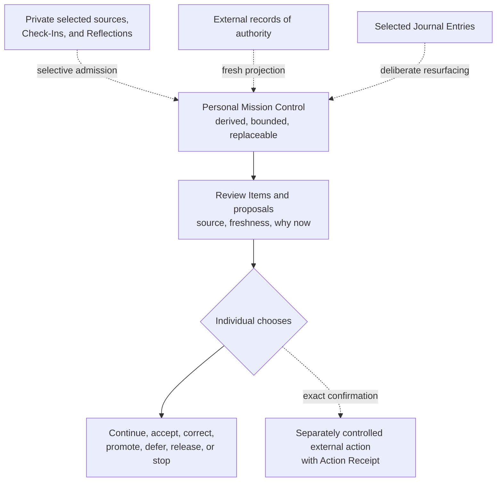

# Personal Mission Control

Personal Mission Control is an optional, stack-agnostic Focus pattern that
composes selected context for one individual's attention and continuity. It may
cover work, personal life, or both according to the individual's chosen life
scope.

It is a derived view, never a record of authority. It is not a required
dashboard, everything app, team command center, task system, knowledge system,
relationship system, or calendar replacement. A person can practice Focus
without it.

## Purpose

Personal Mission Control helps the individual answer:

- What contexts and intentions have I deliberately included?
- What deserves attention now, and why now?
- What am I returning to, and what continuity cue is trustworthy?
- Which items require human clarification, acceptance, promotion, or action?
- What should be deferred, released, dismissed, or left private?
- Which records and external systems remain authoritative?
- Where is a projection stale, conflicted, unavailable, or no longer useful?

Its intended value is easier orientation and accountable choice. Whether it
helps a particular individual remains a question for that person; maintaining
a comprehensive view is not a goal.

## Optional composition

The individual may choose to include:

- selected intentions and constraints;
- continuity cues and Transition Check-Ins;
- selected Journal Entries or Reflections admitted for the current purpose;
- Review Items with source, freshness, why now, and available choices;
- projections from authoritative external records;
- pending corrections or promotions;
- AI proposals and drafts clearly marked as unaccepted;
- completed Action Receipts; and
- portable-exit or recovery warnings.

No component is mandatory. Each retains its own source, status, authority,
freshness, and boundary.

The dotted inputs remain authoritative elsewhere. Mission Control organizes a
bounded view; it does not absorb or synchronize their authority.

## Record contract

Every displayed matter should make these properties inspectable:

| Property | Requirement |
| --- | --- |
| Purpose | Why this material was admitted into the current view |
| Source | The physical or digital origin |
| Status | Source, derivative, proposal, accepted record, projection, or receipt |
| Record of authority | The controlling artifact or system for this purpose |
| Freshness | When authority was last observed and whether currentness is known |
| Why now | Why the item is being presented at this time |
| Choices | Continue, accept, correct, promote, defer, release, delete, no action, or stop |
| Boundary | Privacy, retention, provider exposure, and shared-promotion limits |
| Conflict | Any unresolved disagreement that prevents safe acceptance or action |

If the view cannot show these properties, it should narrow or omit the item
rather than imply certainty.

## Bounded Focus Review

Personal Mission Control may support a Focus Review. The individual selects a
time, item count, context, or decision type. The review ends when its bound is
reached or the individual chooses to stop.

For each Review Item:

1. inspect source and freshness;
2. understand why it is being shown now;
3. clarify uncertainty, conflict, or proposal status;
4. choose among action and non-action outcomes; and
5. preserve only the continuity or receipt the individual needs.

A clear dismissal is a valid result. There is no required Today screen, zero
inbox, fixed review cadence, overdue shame, streak, or automatic priority.

## Mixed work and personal life

Combined life scope can surface a bounded work deadline beside a selected
personal responsibility so the individual can make a truthful attention
choice. It does not merge work and personal records or expose one context to the
other.

Use separate admission and display boundaries:

- work material remains subject to its external authority and confidentiality;
- personal and Journal material remains private unless deliberately selected;
- shared work promotion contains only the bounded artifact approved for that
  destination; and
- the view can hide or remove either life context without damaging authoritative
  records.

## AI within Mission Control

AI may propose Review Items, connections, continuity summaries, questions, or
drafts from explicitly admitted material. Each proposal must identify its
supporting source or source span, remain visibly unaccepted, and expose why it
is being presented.

AI cannot:

- rank the person's life through a hidden objective;
- expand context because another source appears relevant;
- receive blanket Journal or account access by default;
- accept a correction or promotion;
- write directly to an authoritative record;
- send, change, cancel, or delete an external record; or
- retry an external action after failure.

The individual accepts, corrects, rejects, defers, releases, or ignores each
proposal. Any external mutation happens separately and produces an Action
Receipt.

## Implementation independence

Personal Mission Control can be assembled with paper, ordinary documents,
several existing tools, a dedicated application, or a changing combination.
The framework defines no screen, schema, status taxonomy, synchronization
protocol, storage architecture, provider, or notification system.

A future application may demonstrate one implementation only if it pins an
exact Focus release and preserves records of authority outside the derived
view. Its feature set cannot make itself the canonical Focus method.

## Failure and exit

Mission Control has drifted outside Focus when:

- first value requires connecting or ingesting everything;
- the derived view becomes the only usable copy of accepted context;
- personal and shared boundaries are difficult to understand;
- stale projections appear current;
- hidden ranking or repeated reminders coerce attention;
- all items are treated as tasks requiring closure;
- review burden equals or exceeds continuity value;
- a team, manager, or organization gains access to the private practice; or
- provider exit prevents manual continuation.

The individual must be able to remove a source, disconnect a connector, export
accepted context in usable forms, and continue through paper or ordinary files.
When a smaller continuity cue works, prefer it over maintaining Mission Control.
