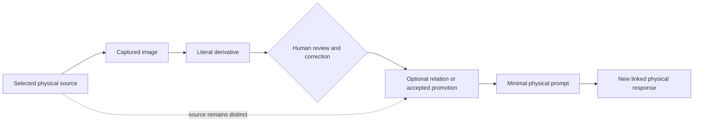

# Physical and digital practice

Paper and digital tools are complementary Focus surfaces. Paper is first-class,
paper-only completion is valid, and digitization is optional. Moving selected
material between surfaces must preserve source identity, review, authority, and
the ability to continue without a provider.

## Paper-only is complete

An individual can complete a Focus episode on paper by:

- marking why something matters;
- recording where it stands;
- choosing a next step, deferral, release, or stopping point;
- leaving a visible continuity cue; and
- reflecting on the same or a later sheet.

No scan, transcription, index, application, or digital twin is required. A
paper source does not need to be destroyed after use or replaced with
proprietary physical materials.

## Selective capture

Digitize only when a stated purpose justifies the added burden and exposure.

Before capture, decide:

1. **Purpose:** What specific continuity, retrieval, connection, or promotion
   need does this selected material serve?
2. **Selection:** What minimum page, passage, mark, or diagram is needed?
3. **Authority:** Will paper remain authoritative, or is a named destination
   authoritative for a different purpose?
4. **Retention:** Which image, derivative, correction, and provider copy should
   remain, and for how long?
5. **Exposure:** What service or person may see the material?
6. **Sensitivity:** Does the material contain third-party, confidential,
   personal, or otherwise sensitive context that requires additional authority
   or should remain physical?
7. **Exit:** Can the accepted result and its provenance be recovered without the
   capture provider?

Capture is foreground. Ambient recording, watched folders, unattended notebook
ingestion, bulk import, and capture-completeness goals are outside the
framework.

## Keep representations distinct

| Representation | Meaning | Authority rule |
| --- | --- | --- |
| Physical source | Original paper artifact | Retains identity and is not destroyed by capture |
| Captured image | Visual derivative of selected material | Supports review; does not replace the source |
| Literal derivative | Close transcription or extraction | Preserves uncertainty and visible source relation |
| Corrected derivative | Human-reviewed representation | Records corrections without rewriting the source |
| Proposal | Suggested interpretation, relation, summary, or next step | Unaccepted until the individual reviews it |
| Accepted record | Material deliberately accepted into a named record of authority | Controls only for its stated purpose |
| Projection | Replaceable view of authority held elsewhere | Shows source and freshness; never silently controls |
| Physical prompt | Minimal cue returned to paper | Points to useful context without copying everything |
| Linked physical response | New handwritten source created later | Has its own identity and provenance relation |

One artifact may be authoritative for one purpose and merely supporting
evidence for another. No timestamp, quality score, or synchronization result
decides that authority automatically.

## Optional physical-digital-physical round trip

The flagship v1 practice is an optional round trip:

The arrows show one example relationship, not a required sequence. The person
may stop at any point, skip the digital portion entirely, reject the derivative,
or retain no provider copy.

### 1. Select the source

Identify the exact page, passage, or mark and why it is useful. Record enough
physical location detail to find the source again without building a complete
notebook index.

### 2. Create a captured image

Capture only the selected material. Preserve its relationship to the physical
source. Decide whether the image is temporary or retained.

### 3. Produce a literal derivative

Keep the first derivative close to the source. Mark unreadable text, uncertain
structure, and non-text elements instead of guessing. Extraction quality does
not grant authority.

### 4. Review and correct

The individual compares consequential details and meaning with the source.
Corrections create a reviewed derivative; they do not alter or erase the
physical source or literal derivative.

### 5. Connect or promote selectively

The individual may relate the derivative to selected context or promote a
bounded accepted passage into a named record of authority. A promotion records
the source, reviewed representation, destination, and result. Rejection or no
promotion is valid.

### 6. Return a minimal prompt to paper

A small physical cue may point to the accepted digital context or next chosen
step. It should not require copying the entire digital record back to paper.

### 7. Create a linked physical response

A later handwritten note is a new physical source, not an edit to the earlier
one. Link it only as much as the purpose requires. It may begin another round
trip, remain paper-only, or be released.

## Corrections and conflicts

When representations disagree:

- keep the disagreement visible;
- identify which record controls for the current purpose;
- compare with the original source when possible;
- record the human correction and its reason;
- avoid silently rewriting prior derivatives; and
- retain only the history needed for provenance and accountability.

If the source is unavailable or ambiguous, mark the uncertainty. Do not allow a
cleaned derivative, AI proposal, or newer projection to manufacture certainty.

## Privacy and retention

- Capture only the region needed for the stated purpose.
- Exclude unrelated names, notes, backgrounds, and identifying details.
- Keep sensitive or third-party material physical when digital exposure is not
  justified.
- State whether captured images and provider copies are temporary.
- Delete derived material when its purpose ends unless another named purpose
  justifies retention.
- Do not treat deletion of a derivative as permission to destroy an
  authoritative source.
- Do not infer that a provider deleted every copy without visible evidence.

## Recovery and exit

The individual should be able to recover accepted passages, corrections,
relations, and physical-source references in usable forms. When a tool fails,
the practice should continue from paper, ordinary files, or another chosen
surface. A broken projection must show stale or unknown freshness rather than
appear current.

The round trip has failed the framework if the physical source becomes
unusable, the accepted result cannot be understood outside one provider, the
provenance is lost, or digitization becomes necessary for first value.
